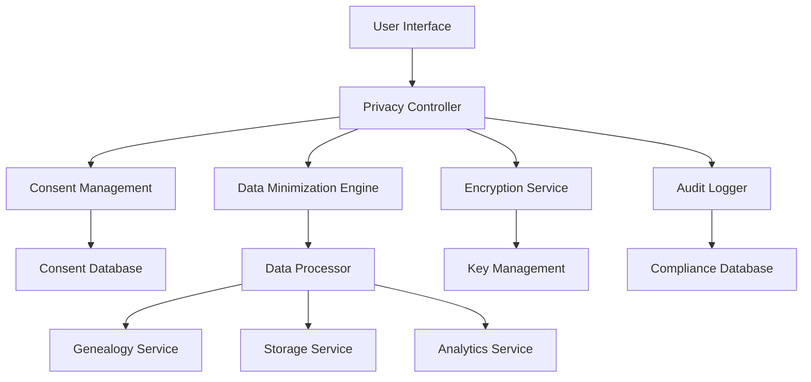

# Data Privacy and GDPR Compliance Guide

## Executive Summary

The Dzinza Genealogy Platform is committed to protecting user privacy and ensuring full compliance with global data protection regulations, including the General Data Protection Regulation (GDPR), California Consumer Privacy Act (CCPA), and other applicable privacy laws. This document outlines our comprehensive approach to data privacy, user rights, and regulatory compliance.

## Table of Contents

1. [Data Protection Principles](#data-protection-principles)
2. [Legal Basis for Processing](#legal-basis-for-processing)
3. [Data Categories and Purposes](#data-categories-and-purposes)
4. [User Rights and Controls](#user-rights-and-controls)
5. [Technical Implementation](#technical-implementation)
6. [Data Retention and Deletion](#data-retention-and-deletion)
7. [Cross-Border Data Transfers](#cross-border-data-transfers)
8. [Breach Response Procedures](#breach-response-procedures)
9. [Vendor Management](#vendor-management)
10. [Compliance Monitoring](#compliance-monitoring)

## Data Protection Principles

### 1. Lawfulness, Fairness, and Transparency
- All data processing activities have a valid legal basis
- Processing purposes are clearly communicated to users
- Transparent privacy notices in English, Shona, and Ndebele

### 2. Purpose Limitation
- Data collected only for specified, explicit, and legitimate purposes
- No further processing incompatible with original purposes
- Clear boundaries between different service features

### 3. Data Minimization
- Collect only data that is adequate, relevant, and limited to purpose
- Regular audits to identify and eliminate unnecessary data collection
- Progressive disclosure of data requirements

### 4. Accuracy
- Implement systems to ensure data accuracy and currency
- Provide user interfaces for data correction
- Regular data quality assessments

### 5. Storage Limitation
- Define clear retention periods for different data categories
- Automated deletion processes where appropriate
- Regular review of data retention needs

### 6. Integrity and Confidentiality
- Robust security measures protecting against unauthorized access
- Encryption at rest and in transit
- Regular security assessments and penetration testing

### 7. Accountability
- Comprehensive documentation of all data processing activities
- Regular compliance audits and assessments
- Staff training on data protection requirements

## Legal Basis for Processing

### Consent
**When Used:**
- Optional features like DNA matching with third parties
- Marketing communications
- Advanced analytics and personalization

**Implementation:**
```typescript
interface ConsentRecord {
  userId: string;
  purpose: ConsentPurpose;
  granted: boolean;
  timestamp: Date;
  mechanism: 'opt-in' | 'explicit-consent';
  withdrawalMethod: string;
  version: string;
}

enum ConsentPurpose {
  DNA_MATCHING = 'dna_matching',
  MARKETING = 'marketing',
  ANALYTICS = 'analytics',
  THIRD_PARTY_SHARING = 'third_party_sharing'
}
```

### Contract Performance
**When Used:**
- Account creation and management
- Family tree building and storage
- Photo storage and enhancement
- Historical record searches

### Legitimate Interest
**When Used:**
- Service improvement and optimization
- Security monitoring and fraud prevention
- Technical support and troubleshooting

**Balancing Test Documentation:**
- Regular assessments of legitimate interests vs. user privacy
- Documented balancing tests for each use case
- Clear opt-out mechanisms where required

### Legal Obligation
**When Used:**
- Compliance with court orders
- Tax reporting requirements
- Law enforcement cooperation

## Data Categories and Purposes

### Personal Identity Data
```yaml
Category: Personal Identity
Data Types:
  - Full name
  - Email address
  - Date of birth
  - Phone number (optional)
  - Profile photograph
Legal Basis: Contract + Consent
Purposes:
  - Account management
  - User identification
  - Communication
Retention: Account lifetime + 2 years
```

### Genealogical Data
```yaml
Category: Genealogical Information
Data Types:
  - Family relationships
  - Ancestor information
  - Historical records
  - Family photos and documents
  - DNA data (if provided)
Legal Basis: Contract + Explicit Consent
Purposes:
  - Family tree construction
  - Historical research
  - DNA matching (with consent)
Retention: Account lifetime + 7 years (historical significance)
Special Category: Yes (genetic data)
```

### Technical Data
```yaml
Category: Technical Information
Data Types:
  - IP addresses
  - Browser information
  - Device identifiers
  - Usage patterns
  - Performance metrics
Legal Basis: Legitimate Interest
Purposes:
  - Service optimization
  - Security monitoring
  - Technical support
Retention: 2 years maximum
```

### Communication Data
```yaml
Category: Communications
Data Types:
  - Support tickets
  - User feedback
  - Email communications
  - In-app messages
Legal Basis: Contract + Legitimate Interest
Purposes:
  - Customer support
  - Service improvement
  - User communication
Retention: 3 years
```

## User Rights and Controls

### Right to Information
**Implementation:**
- Comprehensive privacy policy available in multiple languages
- Just-in-time notifications for data collection
- Clear explanations of processing purposes

### Right of Access
**User Portal Features:**
```typescript
interface DataAccessRequest {
  userId: string;
  requestType: 'full_export' | 'specific_category';
  categories?: DataCategory[];
  format: 'json' | 'csv' | 'pdf';
  deliveryMethod: 'download' | 'email';
  requestDate: Date;
  fulfillmentDate?: Date;
  status: 'pending' | 'processing' | 'completed' | 'rejected';
}
```

**Automated Response:**
- Data export available within 30 days
- Structured format including metadata
- Verification processes to prevent unauthorized access

### Right to Rectification
**User Controls:**
- Self-service data correction interfaces
- Bulk update capabilities for genealogical data
- Version control for data changes
- Admin review process for sensitive corrections

### Right to Erasure
**Implementation Scenarios:**
1. **Full Account Deletion**
   - Complete removal of all personal data
   - Anonymization of derived insights
   - Notification to data processors

2. **Selective Data Deletion**
   - Granular control over data categories
   - Dependency analysis (e.g., family tree relationships)
   - User confirmation workflows

```typescript
interface DeletionRequest {
  userId: string;
  scope: 'full_account' | 'selective';
  categories?: DataCategory[];
  reason: DeletionReason;
  confirmationRequired: boolean;
  dependencies: string[];
  scheduledDate?: Date;
  status: DeletionStatus;
}
```

### Right to Data Portability
**Export Formats:**
- **GEDCOM**: Standard genealogy format
- **JSON**: Structured data with metadata
- **CSV**: Tabular data for analysis
- **PDF**: Human-readable reports

**Transfer Capabilities:**
- Direct transfer to supported platforms
- API endpoints for third-party integrations
- Batch processing for large datasets

### Right to Object
**Opt-out Mechanisms:**
```typescript
interface ObjectionRecord {
  userId: string;
  processingPurpose: ProcessingPurpose;
  objectionDate: Date;
  reason?: string;
  status: 'active' | 'withdrawn';
  impact: string[];
}
```

### Rights Related to Automated Decision Making
**Automated Processes:**
- DNA matching algorithms
- Historical record suggestions
- Photo enhancement recommendations

**User Controls:**
- Opt-out from automated processing
- Request human review of decisions
- Explanation of algorithmic logic

## Technical Implementation

### Privacy by Design Architecture



### Data Classification System

```typescript
interface DataClassification {
  level: SecurityLevel;
  category: DataCategory;
  sensitivity: SensitivityLevel;
  regulations: ApplicableRegulation[];
  encryptionRequired: boolean;
  retentionPeriod: number;
  accessControls: AccessControl[];
}

enum SecurityLevel {
  PUBLIC = 'public',
  INTERNAL = 'internal',
  CONFIDENTIAL = 'confidential',
  RESTRICTED = 'restricted'
}

enum SensitivityLevel {
  LOW = 'low',
  MEDIUM = 'medium',
  HIGH = 'high',
  CRITICAL = 'critical'
}
```

### Encryption Implementation

```typescript
class DataEncryption {
  private static readonly ALGORITHM = 'AES-256-GCM';
  private static readonly KEY_DERIVATION = 'PBKDF2';
  
  static encryptPersonalData(data: string, userKey: string): EncryptedData {
    const iv = crypto.randomBytes(16);
    const salt = crypto.randomBytes(32);
    const key = crypto.pbkdf2Sync(userKey, salt, 100000, 32, 'sha256');
    
    const cipher = crypto.createCipher(this.ALGORITHM, key, iv);
    const encrypted = Buffer.concat([cipher.update(data, 'utf8'), cipher.final()]);
    
    return {
      encrypted: encrypted.toString('base64'),
      iv: iv.toString('base64'),
      salt: salt.toString('base64'),
      authTag: cipher.getAuthTag().toString('base64')
    };
  }
  
  static encryptGeneticData(data: GeneticData): EncryptedGeneticData {
    // Special handling for genetic data with additional security layers
    const masterKey = this.deriveGeneticKey(data.userId);
    const encryptedSequence = this.encryptPersonalData(data.sequence, masterKey);
    
    return {
      userId: data.userId,
      encryptedSequence,
      metadata: this.encryptMetadata(data.metadata),
      keyVersion: this.getCurrentKeyVersion(),
      timestamp: new Date()
    };
  }
}
```

### Anonymization and Pseudonymization

```typescript
class DataAnonymization {
  static anonymizeForAnalytics(userData: UserData): AnonymizedData {
    return {
      userHash: this.generateUserHash(userData.id),
      ageGroup: this.categorizeAge(userData.age),
      region: this.generalizeLocation(userData.location),
      treeSize: userData.familyTree.size,
      activityLevel: this.categorizeActivity(userData.lastActivity),
      preferences: this.generalizePreferences(userData.preferences)
    };
  }
  
  static pseudonymizeForResearch(genealogicalData: GenealogyData): PseudonymizedData {
    const pseudoId = this.generatePseudoId(genealogicalData.userId);
    
    return {
      pseudoId,
      relationships: genealogicalData.relationships.map(rel => ({
        type: rel.type,
        generationDistance: rel.generationDistance,
        culturalBackground: rel.culturalBackground
      })),
      timelineEvents: genealogicalData.events.map(event => ({
        type: event.type,
        timeRange: this.generalizeTimeRange(event.date),
        location: this.generalizeLocation(event.location)
      }))
    };
  }
}
```

## Data Retention and Deletion

### Retention Schedule

| Data Category | Retention Period | Legal Basis | Deletion Trigger |
|---------------|------------------|-------------|------------------|
| Account Information | Account lifetime + 2 years | Contract | Account deletion + grace period |
| Genealogical Data | Account lifetime + 7 years | Historical significance | User request or legal requirement |
| DNA Data | Until withdrawal of consent | Explicit consent | Consent withdrawal |
| Communication Records | 3 years | Legitimate interest | Automatic expiration |
| Technical Logs | 2 years | Legitimate interest | Rolling deletion |
| Marketing Data | Until opt-out + 30 days | Consent | Consent withdrawal |
| Legal Hold Data | Until resolution | Legal obligation | Legal requirement lifted |

### Automated Deletion System

```typescript
class RetentionManager {
  async processRetentionSchedule(): Promise<void> {
    const retentionPolicies = await this.getActiveRetentionPolicies();
    
    for (const policy of retentionPolicies) {
      const expiredData = await this.identifyExpiredData(policy);
      
      if (expiredData.length > 0) {
        await this.initiateSecureDeletion(expiredData, policy);
        await this.logDeletionActivity(expiredData, policy);
      }
    }
  }
  
  private async initiateSecureDeletion(
    data: ExpiredDataRecord[], 
    policy: RetentionPolicy
  ): Promise<void> {
    // Multi-pass deletion for sensitive data
    for (let pass = 0; pass < 3; pass++) {
      await this.overwriteData(data, this.generateRandomPattern());
    }
    
    // Final deletion
    await this.removeDataRecords(data);
    
    // Update deletion certificates
    await this.generateDeletionCertificates(data, policy);
  }
}
```

## Cross-Border Data Transfers

### Transfer Mechanisms

1. **Adequacy Decisions**
   - Transfers to countries with EU adequacy decisions
   - Ongoing monitoring of adequacy status

2. **Standard Contractual Clauses (SCCs)**
   - Implementation of EU-approved SCCs
   - Regular review and updates

3. **Binding Corporate Rules (BCRs)**
   - Development of comprehensive BCRs for group transfers
   - Regulatory approval process

### Data Localization Requirements

```typescript
interface DataLocalizationRule {
  country: string;
  dataTypes: DataCategory[];
  requirement: 'must_stay' | 'copy_required' | 'notification_required';
  exceptions: string[];
  implementation: LocalizationImplementation;
}

class DataLocalizationManager {
  async determineStorageLocation(
    data: DataRecord, 
    userLocation: string
  ): Promise<StorageLocation> {
    const rules = await this.getApplicableRules(userLocation, data.category);
    
    for (const rule of rules) {
      if (rule.requirement === 'must_stay') {
        return this.getLocalStorage(userLocation);
      }
    }
    
    return this.getOptimalStorage(data, userLocation);
  }
}
```

## Breach Response Procedures

### Incident Classification

```typescript
enum BreachSeverity {
  LOW = 'low',           // <100 users, no sensitive data
  MEDIUM = 'medium',     // 100-1000 users or limited sensitive data
  HIGH = 'high',         // >1000 users or significant sensitive data
  CRITICAL = 'critical'  // >10000 users or genetic/financial data
}

interface BreachIncident {
  id: string;
  severity: BreachSeverity;
  dataTypes: DataCategory[];
  affectedUsers: number;
  discoveryDate: Date;
  containmentDate?: Date;
  notificationRequired: boolean;
  regulatoryDeadline?: Date;
  status: IncidentStatus;
  responseTeam: string[];
}
```

### Response Timeline

| Timeframe | Action Required | Responsible Party |
|-----------|----------------|-------------------|
| Immediate (0-1 hours) | Incident detection and containment | Security Team |
| 1-4 hours | Initial assessment and team activation | CISO, Legal |
| 4-24 hours | Detailed investigation and impact analysis | Security Team, DPO |
| 24-72 hours | Regulatory notification (if required) | DPO, Legal |
| 72 hours - 30 days | User notification and remediation | Communications, Product |
| 30+ days | Follow-up actions and improvements | All Teams |

### Notification Templates

```typescript
interface BreachNotification {
  template: NotificationTemplate;
  language: string;
  personalizedData: PersonalizedNotificationData;
  deliveryMethod: 'email' | 'in_app' | 'postal';
  urgency: NotificationUrgency;
  followUpRequired: boolean;
}

class BreachNotificationManager {
  async generateUserNotification(
    breach: BreachIncident, 
    user: User
  ): Promise<BreachNotification> {
    const template = this.selectTemplate(breach.severity, user.preferredLanguage);
    const personalizedData = this.generatePersonalizedData(breach, user);
    
    return {
      template,
      language: user.preferredLanguage,
      personalizedData,
      deliveryMethod: this.determineDeliveryMethod(breach.severity),
      urgency: this.calculateUrgency(breach),
      followUpRequired: breach.severity >= BreachSeverity.HIGH
    };
  }
}
```

## Vendor Management

### Privacy Impact Assessments

```typescript
interface VendorPrivacyAssessment {
  vendorName: string;
  serviceDescription: string;
  dataTypes: DataCategory[];
  dataVolume: DataVolume;
  processingPurposes: ProcessingPurpose[];
  dataLocation: string[];
  securityMeasures: SecurityMeasure[];
  contractualSafeguards: ContractualSafeguard[];
  riskLevel: RiskLevel;
  approvalDate?: Date;
  reviewDate: Date;
  complianceStatus: ComplianceStatus;
}

class VendorManagement {
  async assessVendorCompliance(vendor: Vendor): Promise<ComplianceAssessment> {
    const assessment = {
      certifications: await this.verifyCertifications(vendor),
      contractTerms: await this.reviewContractTerms(vendor),
      technicalSafeguards: await this.evaluateTechnicalSafeguards(vendor),
      operationalControls: await this.assessOperationalControls(vendor),
      incidentResponse: await this.reviewIncidentProcedures(vendor)
    };
    
    return this.calculateOverallCompliance(assessment);
  }
}
```

## Compliance Monitoring

### Continuous Monitoring Framework

```typescript
class ComplianceMonitor {
  private monitors: ComplianceMonitor[] = [
    new ConsentMonitor(),
    new DataRetentionMonitor(),
    new AccessControlMonitor(),
    new EncryptionMonitor(),
    new VendorComplianceMonitor(),
    new UserRightsMonitor()
  ];
  
  async runDailyChecks(): Promise<ComplianceReport> {
    const results = await Promise.all(
      this.monitors.map(monitor => monitor.performCheck())
    );
    
    const report = this.generateComplianceReport(results);
    
    if (report.hasViolations) {
      await this.triggerIncidentResponse(report);
    }
    
    return report;
  }
}
```

### Key Performance Indicators

| Metric | Target | Measurement |
|--------|--------|-------------|
| Consent Rate | >80% | Daily |
| Data Subject Request Response Time | <30 days | Per request |
| Breach Detection Time | <1 hour | Per incident |
| Encryption Coverage | 100% sensitive data | Daily |
| Vendor Compliance Score | >90% | Quarterly |
| User Rights Fulfillment | >95% | Monthly |
| Data Retention Compliance | 100% | Daily |
| Cross-border Transfer Compliance | 100% | Per transfer |

### Audit Trail Requirements

```typescript
interface AuditEvent {
  eventId: string;
  timestamp: Date;
  userId?: string;
  adminId?: string;
  eventType: AuditEventType;
  dataCategory: DataCategory;
  action: string;
  details: Record<string, any>;
  ipAddress: string;
  userAgent: string;
  legalBasis: LegalBasis;
  outcome: 'success' | 'failure' | 'partial';
  retentionPeriod: number;
}

enum AuditEventType {
  DATA_ACCESS = 'data_access',
  DATA_MODIFICATION = 'data_modification',
  DATA_DELETION = 'data_deletion',
  CONSENT_CHANGE = 'consent_change',
  EXPORT_REQUEST = 'export_request',
  ADMIN_ACTION = 'admin_action',
  SYSTEM_EVENT = 'system_event'
}
```

## Implementation Checklist

### Phase 1: Foundation (Weeks 1-4)
- [ ] Privacy policy creation (multi-language)
- [ ] Consent management system implementation
- [ ] Data classification and inventory
- [ ] Basic encryption implementation
- [ ] Audit logging system

### Phase 2: Core Rights (Weeks 5-8)
- [ ] User access portal development
- [ ] Data export functionality
- [ ] Deletion workflows and verification
- [ ] Consent withdrawal mechanisms
- [ ] Basic vendor assessments

### Phase 3: Advanced Features (Weeks 9-12)
- [ ] Automated retention management
- [ ] Breach response procedures
- [ ] Advanced anonymization techniques
- [ ] Cross-border transfer safeguards
- [ ] Compliance monitoring dashboard

### Phase 4: Optimization (Weeks 13-16)
- [ ] Performance optimization
- [ ] Advanced analytics (privacy-preserving)
- [ ] Automated compliance reporting
- [ ] Regular audit procedures
- [ ] Staff training programs

## Legal Contacts and Resources

### Regulatory Authorities
- **EU**: European Data Protection Board (EDPB)
- **UK**: Information Commissioner's Office (ICO)
- **US**: Federal Trade Commission (FTC)
- **Zimbabwe**: Postal and Telecommunications Regulatory Authority (POTRAZ)

### Emergency Contacts
- **Data Protection Officer**: dpo@dzinza.com
- **Legal Counsel**: legal@dzinza.com
- **Security Team**: security@dzinza.com
- **Incident Response**: incident-response@dzinza.com

---

*This document is reviewed quarterly and updated as needed to reflect changes in applicable laws and regulations. Last updated: December 2024*
