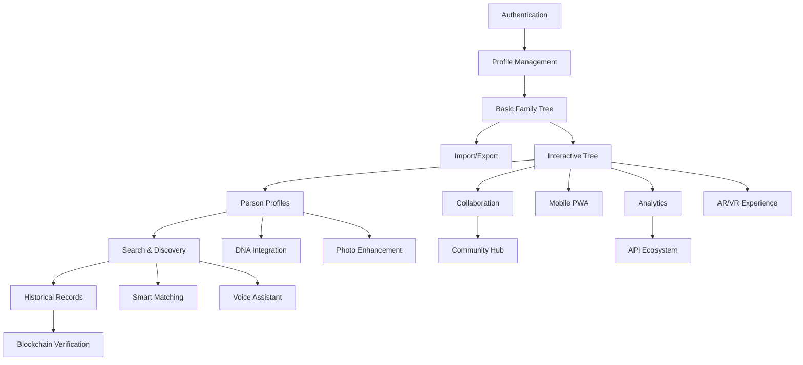

# Feature Specifications

## Overview

This document provides detailed specifications for all features planned for the Dzinza genealogy platform, organized by development phases and priority levels.

## Feature Classification System

### Priority Levels
- **P0 - Critical**: Core functionality required for MVP
- **P1 - High**: Important features for competitive advantage
- **P2 - Medium**: Enhanced user experience features
- **P3 - Low**: Nice-to-have features for future consideration

### Development Phases
- **Phase 1**: Foundation (Months 1-3)
- **Phase 2**: Core Features (Months 4-6)
- **Phase 3**: Advanced Features (Months 7-9)
- **Phase 4**: Innovation & Scale (Months 10-12)

## Phase 1: Foundation Features

### F1.1 User Authentication & Authorization
**Priority**: P0  
**Effort**: 2 weeks  
**Dependencies**: None

**Description**: Secure user registration, login, and session management with multi-factor authentication support.

**Acceptance Criteria**:
- [ ] User can register with email and password
- [ ] Email verification required for account activation
- [ ] Secure password requirements (8+ chars, mixed case, numbers, symbols)
- [ ] JWT-based authentication with refresh tokens
- [ ] Multi-factor authentication via SMS/TOTP
- [ ] Password reset functionality
- [ ] Role-based access control (User, Admin, Expert)
- [ ] Account deactivation and data export options
- [ ] OAuth integration (Google, Facebook)

**Technical Requirements**:
- JWT tokens with 15-minute expiry
- Refresh tokens with 30-day expiry
- bcrypt password hashing (12 rounds)
- Rate limiting on authentication endpoints
- HTTPS-only session cookies
- GDPR-compliant data handling

**User Stories**:
```
As a new user, I want to create an account so that I can start building my family tree.
As a user, I want to log in securely so that my family data remains protected.
As a user, I want to enable 2FA so that my account has additional security.
```

### F1.2 Basic Profile Management
**Priority**: P0  
**Effort**: 1 week  
**Dependencies**: F1.1

**Description**: User profile creation and management with privacy controls and cultural sensitivity.

**Acceptance Criteria**:
- [ ] Personal information input (name, birth date, location)
- [ ] Profile photo upload and management
- [ ] Privacy settings configuration
- [ ] Language preference selection
- [ ] Cultural background specification
- [ ] Contact information management
- [ ] Biography and story writing
- [ ] Profile sharing controls

**Technical Requirements**:
- Image upload with automatic resizing
- Privacy controls at field level
- Multi-language form validation
- Cultural naming convention support
- GDPR-compliant data storage

### F1.3 Basic Family Tree Structure
**Priority**: P0  
**Effort**: 3 weeks  
**Dependencies**: F1.2

**Description**: Core family tree functionality with person and relationship management.

**Acceptance Criteria**:
- [ ] Add family members (parents, siblings, children, spouses)
- [ ] Define relationships between individuals
- [ ] Basic tree visualization (3 generations)
- [ ] Person detail views
- [ ] Relationship editing and deletion
- [ ] Family group management
- [ ] Tree sharing and collaboration permissions
- [ ] Export tree data (GEDCOM format)

**Technical Requirements**:
- PostgreSQL relationship modeling
- D3.js tree visualization
- Real-time collaboration support
- Cultural family structure support (polygamy, adoption)
- Performance optimization for large trees

### F1.4 Data Import/Export
**Priority**: P1  
**Effort**: 2 weeks  
**Dependencies**: F1.3

**Description**: Import family data from other platforms and export user data for portability.

**Acceptance Criteria**:
- [ ] GEDCOM file import
- [ ] CSV data import
- [ ] Ancestry.com import (API)
- [ ] MyHeritage import (API)
- [ ] Data export in multiple formats
- [ ] Bulk photo import
- [ ] Import validation and error handling
- [ ] Data mapping and transformation tools

**Technical Requirements**:
- GEDCOM parser with validation
- Async import processing
- Progress tracking and notifications
- Data deduplication algorithms
- Error logging and recovery

## Phase 2: Core Features

### F2.1 Interactive Family Tree Visualization
**Priority**: P0  
**Effort**: 4 weeks  
**Dependencies**: F1.3

**Description**: Advanced family tree visualization with interactive navigation and customization.

**Acceptance Criteria**:
- [ ] Zoomable and pannable tree interface
- [ ] Multiple tree layout options (ancestors, descendants, hourglass)
- [ ] Search within tree
- [ ] Tree statistics and insights
- [ ] Customizable visual themes
- [ ] Print and save tree images
- [ ] Mobile-responsive design
- [ ] Accessibility compliance (WCAG 2.1 AA)

**Technical Requirements**:
- D3.js v7 with Canvas/SVG rendering
- Virtual scrolling for performance
- Touch gesture support
- High-resolution export options
- Keyboard navigation support
- Screen reader compatibility

**User Stories**:
```
As a user, I want to navigate my family tree easily so that I can explore my ancestry.
As a user, I want to customize the tree appearance so that it reflects my cultural preferences.
As a mobile user, I want the tree to work well on my phone so that I can view it anywhere.
```

### F2.2 Person Profile Management
**Priority**: P0  
**Effort**: 3 weeks  
**Dependencies**: F2.1

**Description**: Comprehensive individual profile pages with rich biographical information.

**Acceptance Criteria**:
- [ ] Detailed biographical information forms
- [ ] Life timeline creation
- [ ] Photo gallery management
- [ ] Document attachment (certificates, letters)
- [ ] Story and memory recording
- [ ] Location and mapping integration
- [ ] Source citation tracking
- [ ] Fact verification system

**Technical Requirements**:
- Rich text editor for stories
- Image gallery with metadata
- Document storage and indexing
- Map integration (Google Maps/OpenStreetMap)
- Version control for profile changes
- Source management system

### F2.3 Search and Discovery
**Priority**: P1  
**Effort**: 3 weeks  
**Dependencies**: F2.2

**Description**: Powerful search functionality for finding people, records, and connections.

**Acceptance Criteria**:
- [ ] Global person search across all trees
- [ ] Advanced filtering options
- [ ] Fuzzy name matching
- [ ] Location-based search
- [ ] Date range filtering
- [ ] Search result ranking
- [ ] Saved searches
- [ ] Search history

**Technical Requirements**:
- Elasticsearch integration
- Phonetic name matching algorithms
- Geographic search capabilities
- Real-time search suggestions
- Search analytics and optimization
- Multi-language search support

### F2.4 Collaboration Tools
**Priority**: P1  
**Effort**: 2 weeks  
**Dependencies**: F2.1

**Description**: Real-time collaboration features for family research and tree building.

**Acceptance Criteria**:
- [ ] Invite family members to collaborate
- [ ] Real-time tree editing
- [ ] Comment and discussion system
- [ ] Change tracking and history
- [ ] Permission management
- [ ] Notification system
- [ ] Conflict resolution tools
- [ ] Activity feeds

**Technical Requirements**:
- WebSocket real-time communication
- Operational transformation for concurrent editing
- Notification service with email/SMS
- Permission-based data access
- Audit logging for all changes
- Conflict detection and resolution

### F2.5 Mobile Application (PWA)
**Priority**: P1  
**Effort**: 4 weeks  
**Dependencies**: F2.1, F2.2

**Description**: Progressive Web App providing native-like mobile experience.

**Acceptance Criteria**:
- [ ] Installable PWA on mobile devices
- [ ] Offline functionality for tree viewing
- [ ] Touch-optimized tree navigation
- [ ] Camera integration for document capture
- [ ] Voice note recording
- [ ] Push notifications
- [ ] Sync with web application
- [ ] Mobile-specific UI patterns

**Technical Requirements**:
- Service Worker for offline functionality
- IndexedDB for local data storage
- Camera API integration
- Web Push API for notifications
- Responsive design patterns
- Performance optimization for mobile networks

## Phase 3: Advanced Features

### F3.1 DNA Data Integration
**Priority**: P1  
**Effort**: 6 weeks  
**Dependencies**: F2.2

**Description**: DNA data upload, processing, and matching functionality.

**Acceptance Criteria**:
- [ ] Raw DNA data upload (23andMe, AncestryDNA, etc.)
- [ ] DNA data processing and analysis
- [ ] Genetic relative matching
- [ ] Ethnicity estimation
- [ ] Shared DNA visualization
- [ ] Chromosome browser
- [ ] DNA match management
- [ ] Privacy controls for DNA sharing

**Technical Requirements**:
- Secure DNA data storage and encryption
- Bioinformatics algorithms for matching
- High-performance computing for analysis
- Chromosome visualization tools
- Privacy-compliant data handling
- Integration with third-party DNA services

**User Stories**:
```
As a user, I want to upload my DNA data so that I can find genetic relatives.
As a user, I want to see my ethnicity breakdown so that I can understand my heritage.
As a user, I want to control who can see my DNA data so that my privacy is protected.
```

### F3.2 Historical Records Database
**Priority**: P1  
**Effort**: 8 weeks  
**Dependencies**: F2.3

**Description**: Searchable database of historical records with OCR and indexing.

**Acceptance Criteria**:
- [ ] Historical record upload and digitization
- [ ] OCR processing for text extraction
- [ ] Record categorization and tagging
- [ ] Advanced record search
- [ ] Record-to-person matching suggestions
- [ ] Source citation generation
- [ ] Community record verification
- [ ] Record image viewer with zoom

**Technical Requirements**:
- MongoDB for document storage
- OCR engine (Tesseract/Cloud Vision)
- Natural language processing for text analysis
- Machine learning for record matching
- High-resolution image handling
- Elasticsearch for full-text search

### F3.3 AI Photo Enhancement
**Priority**: P1  
**Effort**: 5 weeks  
**Dependencies**: F2.2

**Description**: AI-powered photo restoration, colorization, and enhancement tools.

**Acceptance Criteria**:
- [ ] Photo upload and management
- [ ] Automatic photo enhancement
- [ ] AI colorization for black and white photos
- [ ] Face detection and recognition
- [ ] Photo dating estimation
- [ ] Before/after comparison views
- [ ] Batch processing capabilities
- [ ] Quality assessment and recommendations

**Technical Requirements**:
- WebAssembly for client-side processing
- TensorFlow.js models for enhancement
- Cloud GPU processing for heavy operations
- Image processing pipelines
- Quality metrics and validation
- Progressive enhancement approach

### F3.4 Smart Matching & Suggestions
**Priority**: P2  
**Effort**: 4 weeks  
**Dependencies**: F2.3, F3.2

**Description**: AI-powered suggestions for family connections and historical records.

**Acceptance Criteria**:
- [ ] Automatic person matching across trees
- [ ] Historical record suggestions
- [ ] Missing information detection
- [ ] Duplicate person identification
- [ ] Relationship suggestion algorithms
- [ ] Confidence scoring for matches
- [ ] User feedback integration
- [ ] Match review and approval workflow

**Technical Requirements**:
- Machine learning models for matching
- Similarity scoring algorithms
- Fuzzy matching for names and dates
- Active learning from user feedback
- Real-time suggestion generation
- Performance optimization for scale

### F3.5 Advanced Analytics & Insights
**Priority**: P2  
**Effort**: 3 weeks  
**Dependencies**: F2.1, F3.1

**Description**: Analytics dashboard with family insights and statistics.

**Acceptance Criteria**:
- [ ] Family tree statistics and visualizations
- [ ] Geographic ancestry mapping
- [ ] Timeline of family events
- [ ] Surname distribution analysis
- [ ] Migration pattern visualization
- [ ] Longevity and health insights
- [ ] Cultural tradition tracking
- [ ] Exportable reports

**Technical Requirements**:
- Data analytics processing pipeline
- Interactive visualization library (D3.js/Chart.js)
- Geographic mapping integration
- Statistical analysis algorithms
- Caching for performance
- Responsive chart designs

## Phase 4: Innovation & Scale

### F4.1 Voice Assistant Integration
**Priority**: P2  
**Effort**: 6 weeks  
**Dependencies**: F2.3

**Description**: Voice-controlled genealogy research in native African languages.

**Acceptance Criteria**:
- [ ] Voice search in English, Shona, Ndebele
- [ ] Voice commands for tree navigation
- [ ] Audio story recording
- [ ] Voice-to-text transcription
- [ ] Pronunciation guides for names
- [ ] Voice accessibility features
- [ ] Multi-language voice support
- [ ] Offline voice processing

**Technical Requirements**:
- Web Speech API integration
- Custom speech recognition models
- Natural language processing
- Audio processing and storage
- Multi-language support
- Accessibility compliance

### F4.2 Blockchain Record Verification
**Priority**: P3  
**Effort**: 8 weeks  
**Dependencies**: F3.2

**Description**: Blockchain-based verification system for historical record authenticity.

**Acceptance Criteria**:
- [ ] Document hash verification on blockchain
- [ ] Immutable record timestamps
- [ ] Verification badge system
- [ ] Community consensus mechanisms
- [ ] Certificate of authenticity generation
- [ ] Audit trail for all changes
- [ ] Integration with existing verification systems
- [ ] Cost-effective verification process

**Technical Requirements**:
- Blockchain integration (Ethereum/Polygon)
- Smart contracts for verification
- IPFS for document storage
- Cryptographic hash functions
- Gas fee optimization
- Web3 wallet integration

### F4.3 AR/VR Family Tree Experience
**Priority**: P3  
**Effort**: 10 weeks  
**Dependencies**: F2.1

**Description**: Immersive augmented and virtual reality family tree exploration.

**Acceptance Criteria**:
- [ ] AR family tree overlay on mobile
- [ ] VR family tree exploration
- [ ] 3D ancestor avatars
- [ ] Virtual family gatherings
- [ ] Historical location visits
- [ ] Interactive storytelling
- [ ] Multi-user VR sessions
- [ ] Accessibility in VR/AR

**Technical Requirements**:
- WebXR API for VR/AR
- 3D modeling and animation
- Spatial tracking and mapping
- Real-time rendering optimization
- Cross-platform VR support
- Performance optimization for mobile AR

### F4.4 Community Knowledge Hub
**Priority**: P2  
**Effort**: 5 weeks  
**Dependencies**: F2.4

**Description**: Community-driven knowledge sharing and expert consultation platform.

**Acceptance Criteria**:
- [ ] Expert genealogist network
- [ ] Community forums and Q&A
- [ ] Research request system
- [ ] Knowledge base articles
- [ ] Video tutorial library
- [ ] Live consultation booking
- [ ] Peer review system
- [ ] Gamification and rewards

**Technical Requirements**:
- Forum software integration
- Video conferencing API
- Content management system
- Rating and review system
- Payment processing for consultations
- Real-time messaging system

### F4.5 API Ecosystem & Integrations
**Priority**: P2  
**Effort**: 4 weeks  
**Dependencies**: All previous features

**Description**: Comprehensive API platform for third-party integrations and developer ecosystem.

**Acceptance Criteria**:
- [ ] RESTful API with OpenAPI documentation
- [ ] GraphQL API for flexible queries
- [ ] Webhook system for real-time events
- [ ] Rate limiting and usage analytics
- [ ] API key management
- [ ] Developer portal and documentation
- [ ] SDK for popular programming languages
- [ ] Integration marketplace

**Technical Requirements**:
- API gateway for routing and security
- Rate limiting and throttling
- API versioning strategy
- Comprehensive documentation
- SDK generation tools
- Analytics and monitoring

## Feature Dependencies Map



## Implementation Priorities

### MVP Feature Set (Phase 1 + Essential Phase 2)
1. User Authentication (F1.1)
2. Profile Management (F1.2)
3. Basic Family Tree (F1.3)
4. Interactive Tree Visualization (F2.1)
5. Person Profile Management (F2.2)
6. Basic Search (F2.3)
7. Mobile PWA (F2.5)

### Competitive Differentiation Features
1. DNA Integration with African focus (F3.1)
2. Native language voice assistant (F4.1)
3. AI photo enhancement (F3.3)
4. Historical records for Africa (F3.2)
5. Community collaboration (F2.4)

### Innovation Features
1. AR/VR experience (F4.3)
2. Blockchain verification (F4.2)
3. Smart matching AI (F3.4)
4. Advanced analytics (F3.5)
5. API ecosystem (F4.5)

This feature specification provides a comprehensive roadmap for building Dzinza into a world-class genealogy platform that serves the unique needs of African heritage research while incorporating cutting-edge technology and user experience innovations.
