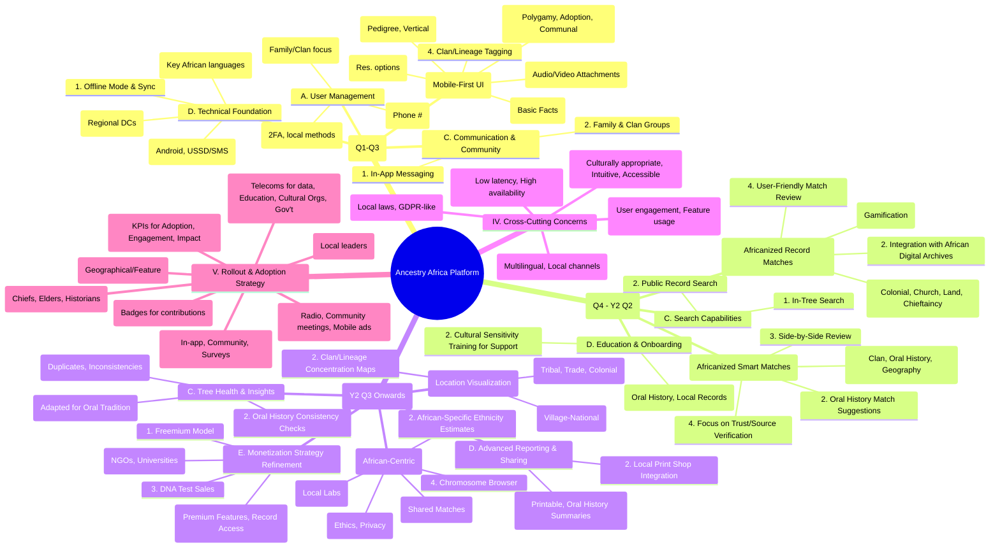

As an experienced product owner and TPM, I've reviewed the features and capabilities of Ancestry.com and MyHeritage.com based on the provided sources. This analysis forms the foundation for a new genealogy platform tailored for the African context.

### Review of Ancestry.com and MyHeritage.com Functionality

Both Ancestry and MyHeritage offer robust platforms for family history research, each with distinct strengths:

**Ancestry.com Features & Workflows:**

- **Family Tree Building:** Offers **free family trees** accessible to anyone, serving as storage and research space. Users can build trees by entering personal details, parents, and grandparents.
- **Historical Records Access:** A core offering where subscriptions provide access to **60 billion records from 88 countries**, with rapid additions.
- **Pro Tools (Add-on Subscription):** Aimed at users with large trees, allowing deeper data analysis and new discoveries.
  - **Tree Views:** Includes **Pedigree (Horizontal)** and **Vertical** views (free to all). Pro Tools enhances the **Fan View** to show up to **seven generations** and includes **heat maps** for hints, photos, and sources.
  - **Charts & Reports:** Pro Tools enables generation of **Ancestor (on and toel) reports** (up to seven generations), **Descendancy reports**, **Register style**, and **Family group sheets**. These can be downloaded as PDFs for printing and sharing. Users can select a "focus person" for reports.
  - **Tree Mapper:** A powerful Pro Tool that visualizes **ancestral locations and journeys**. It allows filtering by direct line, paternal/maternal side, end of line, or floating people, and by specific events like births, marriages, deaths, or residence. The map can **zoom down to county level** in the US, providing insights into migration patterns. Standardized location data is crucial for its effectiveness.
  - **List of All People:** While a basic list is free, Pro Tools offers **advanced filters** by family line (direct, paternal, maternal, end of line, floating) and by **place and year ranges** (e.g., born in North Carolina between 1800-1825). This is valuable for focused research trips.
  - **Error Checker & Tree Rating:** Pro Tools identifies **possible duplicates**, people **with no sources**, or those with **only tree sources**. It helps users clean up their trees, with a **Tree Rating** (e.g., 7.0) indicating tree health.
  - **Enhanced Shared Matches (DNA Integration):** A Pro Tool that adds a third column to DNA shared matches, showing how much DNA your match shares with common matches, enabling powerful brick wall breakthroughs.
- **DNA Services:** Offers DNA testing for ethnicity results and matches, integrated with tree building.
- **Tree Tags:** A **free and powerful feature** allowing users to create custom tags for workflow, research statuses, and life experiences, which can be used to filter the list of all people.
- **GEDCOM Export:** Users can **download their family tree data as a GEDCOM file** for backup or transfer to other programs, though it **does not include images**.

**MyHeritage.com Features & Workflows:**

- **Family Tree Building:** Allows users to **quickly create a tree** by entering basic details.
- **Discoveries (Automated Matches):** This is a key differentiator.
  - **Instant Discoveries:** Can add an **entire new branch with photos in one click**.
  - **Smart Matches:** Connects a user's tree with **other MyHeritage users' trees**, enabling the discovery of new relatives (including side branches like aunts/uncles).
  - **Record Matches:** Reveals **historical records** (birth, marriage, death, census, gravestones, even Holocaust records) relevant to relatives, often providing matches "on a genealogical silver platter".
- **Review Process:** Presents user information alongside new match information for **side-by-side comparison** before acceptance.
- **DNA Services:** Offers autosomal DNA testing for ethnicity estimates and matches. Notable tools include a **Chromosome Browser** and a unique display of **shared matches**, showing DNA shared between your match and common matches.
- **Internal Messaging System:** Allows contact with DNA matches and family tree managers.
- **Charts & Books:** Provides various chart types (e.g., Fan Chart, Ancestors, Descendants) that can be generated for printing.
- **User Base:** Strong presence in **Europe and the US**, making it valuable for those with European lineage.

**Key Differences & Takeaways:**

- **Monetization:** Ancestry has a free tree with paid record access and an _add-on_ Pro Tools subscription, emphasizing depth for power users. MyHeritage is primarily subscription-based, with automated discovery as a core value proposition.
- **Discovery Philosophy:** MyHeritage focuses on automated, often "instant" discoveries to rapidly expand trees. Ancestry emphasizes hints that users review and attach, with Pro Tools providing advanced analysis for user-driven discovery.
- **Data Management:** Ancestry's Pro Tools provide sophisticated tools for managing large trees, checking errors, and visualizing data (maps, detailed filters). MyHeritage excels in surfacing new information through its matching algorithms.
- **DNA:** Both offer strong DNA tools, with similar "shared matches" functionalities designed to reveal deeper connections.

---

### Detailed Roadmap and Requirements Specification for an African Genealogy Platform

**Vision:** To empower individuals across Africa to discover, preserve, and share their family history, connecting generations through accessible technology and culturally relevant data.

**Guiding Principles (African Focus):**

- **Mobile-First & Offline Capable:** Adapt to diverse connectivity and device landscapes.
- **Oral Tradition Integration:** Prioritize capturing and validating rich oral histories, which are paramount in African lineage.
- **Community-Centric:** Foster family and clan connections beyond individual research.
- **Culturally Sensitive Design:** Accommodate complex family structures and naming conventions.
- **Localized Content:** Focus on digitizing and making accessible records relevant to African contexts.
- **Affordable & Accessible:** Consider varying economic realities and digital literacy levels.

**Roadmap Phases:**

**Phase 1: MVP - Core Tree & Oral History (Q1-Q3 Launch)**

- **Goal:** Enable basic tree creation, facilitate oral history capture, and establish fundamental community connections.
- **Requirements Specification:**
  - **1.1 User Management:**
    - **Mobile-First Onboarding:** Simple sign-up primarily via **phone number**, with optional email [New - leveraging common African tech use].
    - **Low Data Usage Profile:** App optimized for minimal data consumption.
    - **Granular Privacy Settings:** Users control visibility of profiles and trees (e.g., private, shared with specific family groups, shared with clan/community members) [Inspired by Ancestry 103, MyHeritage 143].
  - **1.2 Tree Building (Mobile-Optimized UI):**
    - **Intuitive Person Entry:** Streamlined process for adding names, genders, and key relationships.
    - **Support for Complex Family Structures:**
      - **Polygamy:** Allow multiple spouses for an individual, clearly linking children to specific marital units [New - critical for African context].
      - **Alternative Parenthood:** Differentiate biological, adopted, and foster relationships [Inspired by Ancestry 118].
      - **Communal Relationships:** Options to define familial bonds within a broader communal context beyond nuclear family [New].
    - **Oral History Capture:**
      - **Integrated Audio Recording:** Ability to record and attach audio clips of elders recounting family stories, names, and events directly to person profiles [New - core innovation].
      - **Video Snippets:** Option to attach short video clips (e.g., interviews, ceremonies) [New].
      - **Transcription Support:** Basic AI-driven transcription (with manual correction) for common African languages [New - advanced, but essential for discoverability].
    - **Clan/Lineage Tagging:** Dedicated fields and tags for associating individuals with specific clans, ethnic groups, or lineages [New - builds on Ancestry's tree tags 73, but for a specific cultural need].
    - **Photo Uploads:** Support for uploading photos with options for various resolutions to manage data usage [Inspired by MyHeritage 86].
    - **Basic Tree Views:** Pedigree (Horizontal) and Vertical views [Inspired by Ancestry 9, 10].
  - **1.3 Communication & Community:**
    - **In-App Messaging:** Secure chat for connecting with family members and identified matches [Inspired by Ancestry 129, MyHeritage 137].
    - **Family & Clan Groups:** Dedicated spaces for specific family units or clans to collaborate on their tree and share information privately [Inspired by Ancestry's family groups 128].
  - **1.4 Technical Foundation:**
    - **Offline Mode with Sync:** Users can build and edit trees without constant internet access; data syncs when connectivity is available [New - crucial for rural/low-connectivity areas].
    - **Lightweight Mobile App:** Optimized for Android (dominant in Africa) and capable of running on low-end smartphones. Consider **USSD/SMS integration** for basic notifications/actions on feature phones [New].
    - **Multilingual UI:** Support for key African languages (e.g., Swahili, Hausa, Yoruba, Zulu, Amharic, Arabic, French, Portuguese, English) [New - essential for broad adoption].
    - **Scalable Cloud Infrastructure:** Architecture designed for rapid scaling and future data growth, with regional data centers for low latency and data residency compliance.

**Phase 2: Discovery & Expansion (Q4 - Year 2 Q2)**

- **Goal:** Enable users to discover new relatives and historical information through smart matching and localized record access.
- **Requirements Specification:**
  - **2.1 "Lineage Link" (Africanized Smart Matches):**
    - **Advanced Matching Algorithm:** Beyond names and dates, match based on **clan/lineage tags, oral history keywords, and geographic movement patterns** [New - builds on MyHeritage Smart Matches 86, 136, 140].
    - **Oral History Match Suggestions:** Propose connections between individuals based on similar stories or mentioned names/places in audio/video recordings [New].
    - **Side-by-Side Review:** Intuitive UI to compare existing tree data with new match information before adding [Inspired by MyHeritage 141].
    - **Focus on Trust:** Highlight the source of the match (e.g., "From a verified clan elder's tree" vs. "From a general user's tree").
  - **2.2 "Local Record Discoveries" (Africanized Record Matches):**
    - **Curated Data Collections:** Prioritize acquisition and indexing of **African-specific record types**:
      - **Colonial Administrative Records:** Births, deaths, censuses from colonial periods.
      - **Missionary & Church Records:** Baptisms, marriages, burials.
      - **Land Deeds & Tax Records:** Crucial for tracking family presence in specific areas.
      - **Chieftaincy & Community Records:** Minutes from local council meetings, oral testimonies, traditional court records [New - specific to African context].
    - **Integration with Existing African Digital Archives:** APIs to pull data from national archives, university collections, and other online repositories.
    - **Crowdsourced Indexing & Digitization:** Enable community members to contribute to transcribing physical records or indexing digital images, potentially with gamification/incentives [New].
    - **User-Friendly Match Review:** Present relevant record snippets clearly for user validation [Inspired by MyHeritage 136].
  - **2.3 Basic Search Functionality:** Allow users to search within their own tree and across public record collections [Inspired by Ancestry 125].
  - **2.4 In-App Guidance & Education:** Interactive tutorials on how to effectively use oral traditions and local records for genealogical research [New].

**Phase 3: Advanced Features & Ecosystem (Year 2 Q3 onwards)**

- **Goal:** Offer deeper insights, advanced analysis tools, and expand the platform's ecosystem.
- **Requirements Specification:**
  - **3.1 DNA Integration (African-Centric):**
    - **Affordable DNA Testing:** Partner with or establish local labs for more accessible and affordable DNA testing services.
    - **African-Specific Ethnicity Estimates:** Refined reference panels to provide more granular and accurate ethnicity breakdowns relevant to African genetic diversity [Inspired by MyHeritage 145, 146].
    - **DNA Matching:** Comprehensive matching system, including "shared matches" functionality [Inspired by Ancestry 81, MyHeritage 149].
    - **Chromosome Browser:** For advanced users to visualize shared DNA segments [Inspired by MyHeritage 145].
    - **Educational Content:** Clear, culturally sensitive explanations of DNA results, ethical considerations, and privacy implications [New].
  - **3.2 "Kinship Mapper" (Africanized Tree Mapper):**
    - **Migration Visualization:** Map ancestral migration routes, emphasizing historical tribal movements, trade routes, and colonial administrative shifts [Inspired by Ancestry 30, 31].
    - **Clan/Lineage Concentration:** Visualize where specific clans or lineages were historically concentrated [New].
    - **Multi-Level Mapping:** Display data at village, district, regional, and national levels [Inspired by Ancestry 39, 40].
  - **3.3 Tree Health & Insights:**
    - **Enhanced Error Checker:** Identify potential duplicates and data inconsistencies (e.g., illogical timelines, age discrepancies) [Inspired by Ancestry 58, 59].
    - **Oral History Consistency Checks:** Flag discrepancies between oral accounts and recorded facts, prompting user review [New].
    - **Tree Quality Score:** An adapted tree rating system that incorporates the completeness and verification of oral traditions alongside documented sources [Inspired by Ancestry 71].
  - **3.4 Advanced Reporting & Sharing:**
    - **Customizable Reports:** Generate high-quality, printable family group sheets and lineage reports up to multiple generations, with options to include oral history summaries [Inspired by Ancestry 13, 14, MyHeritage 150].
    - **Local Print Shop Integration:** Facilitate easy printing of large charts via partnerships with local print services.

---

### Detailed Mind Map for Staged Rollout

---

### Other Items for Design, Build, Rollout, and Adoption

**For Design and Build:**

- **Extensive User Research (In-country):** Beyond market research, conduct deep ethnographic studies in diverse regions to understand actual user behaviors, cultural nuances around family history, and technological comfort levels. This includes understanding local naming conventions, taboos, and the specific ways oral histories are passed down.
- **Flexible Data Model:** Develop a highly adaptable underlying data model that can gracefully handle the complexities of African family structures, diverse naming patterns, and the integration of both traditional oral sources and modern records.
- **AI/ML for Oral History Processing:** Investigate advanced AI/ML for automated transcription of various African languages, identifying key entities (names, places, events) from audio/video, and cross-referencing information to suggest connections or inconsistencies. This could also include voice recognition for identifying specific narrators over time.
- **Community Moderation Tools:** Build robust tools for local community administrators or appointed moderators to manage content, resolve disputes, and ensure the accuracy and sensitivity of shared information within their groups.
- **Offline Data Security:** Implement strong encryption and security measures for data stored locally on devices during offline mode, safeguarding sensitive family information.
- **Localized Payment Gateways:** Integrate with popular mobile money services (e.g., M-Pesa, MTN MoMo, Airtel Money) alongside traditional credit/debit card options, critical for monetization and accessibility in many African markets.
- **API-First Architecture:** Design the platform with a clear API layer to facilitate future integrations with other genealogy databases, local government archives, or educational platforms.

**For Rollout and Adoption Campaign:**

- **Pilot Programs with Community Champions:** Launch small, controlled pilot programs in select, diverse communities. Identify and empower local "champions" (e.g., community elders, local historians, teachers) who can become early adopters and advocates, training others within their trusted networks.
- **Grassroots Marketing & Awareness:** Leverage traditional communication channels popular in Africa, such as **local radio broadcasts**, community meetings (e.g., under a baobab tree), and **word-of-mouth campaigns**, alongside digital marketing on popular social media platforms. Use **culturally relevant imagery and narratives**.
- **Partnerships for Reach & Trust:**
  - **Telecom Operators:** Collaborate for **subsidized data bundles** or zero-rated access to the app, significantly reducing cost barriers for users.
  - **Educational Institutions:** Partner with universities and schools to integrate the platform into local history or social studies curricula, fostering early adoption among younger generations.
  - **Cultural & Heritage Organizations:** Work with local museums, historical societies, and non-governmental organizations (NGOs) focused on heritage preservation to gain credibility and access existing networks.
  - **Local Governments & Traditional Leaders:** Secure endorsements from chiefs, elders, and local government bodies to build trust and legitimacy within communities.
- **"Train the Trainer" Model:** Develop structured programs to train local facilitators on how to use the app and conduct basic genealogical research, enabling them to cascade knowledge throughout their communities.
- **Regular Feedback Loops & Iteration:** Implement continuous feedback mechanisms, from in-app surveys to regular community workshops, demonstrating responsiveness to user needs and cultural sensitivities. This builds loyalty and ensures the product evolves meaningfully.
- **Gamification for Engagement:** Introduce elements like badges for adding generations, connecting new relatives, uploading oral histories, or solving "family mysteries" to encourage sustained engagement and contribution.
- **Defined Success Metrics & KPIs:** Track not just app downloads, but also active users, average tree size, number of oral history uploads, match confirmation rates, and the growth of family/clan groups. Qualitatively, measure stories of successful family connections and discoveries.
